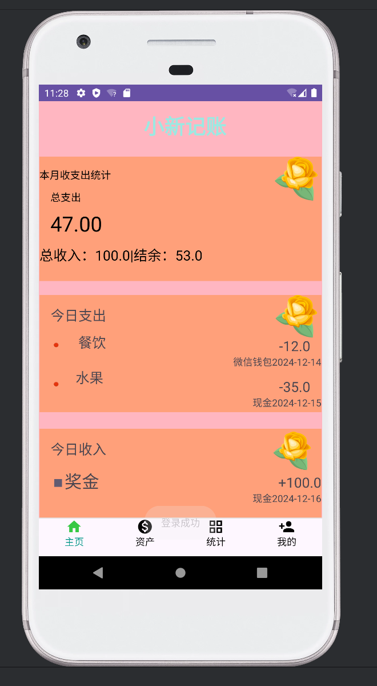

# 📝android-notes-app
# 📔notes

一款专为个人日常收支管理设计的Android记账应用，界面简洁直观，功能实用全面，帮助用户轻松记录、统计和分析财务状况。


[](LICNSE)

##📸应用截图
| 登录界面 | 注册界面 | 首页 |
|----------|----------|------|
|  |  |  |
| 资产页面                         | 明细页面 | 个人中心 |
|------------------------------|----------|----------|
|  |  |  |
| 设置页面 | 退出登录 |
|------|----------|
|  |  |


##✨功能特性

- **用户账户管理**
    
  支持注册/登录功能，保护个人财务数据安全；提供个人信息编辑、系统设置等个性化选项。

- **核心记账功能**
  
  快速记录收入/支出，支持按类别（餐饮、零食、奖金等）分类；支持多账户管理（现金、微信、支付宝等）。

- **数据统计与分析**
  
  主页直观展示收支概览、资产负债情况；明细页面按时间维度记录所有账目；统计功能可视化展示收支趋势。

- **便捷交互设计**
  
  底部导航栏快速切换功能模块（主页、资产、统计、我的）；简洁操作流程，三步完成一笔账目记录。

##🛠️技术栈

- **开发环境**：Android Studio
  
- **编程语言**：Kotlin（主要）、Java（辅助）
  
- **布局框架**：ConstraintLayout、LinearLayout、RelativeLayout
  
- **数据存储**：SQLite（本地数据库）
  
- **架构模式**：MVC（模型-视图-控制器）

##🚀如何运行

1. **克隆仓库**
   
   ```bash
   git clone https://github.com/你的用户名/你的项目名.git
   
2.**打开项目**

启动 Android Studio → 选择 "Open an existing project" → 导航到克隆的仓库目录并打开。

3.**同步与构建**

等待 Gradle 自动同步完成（或点击工具栏 "Sync Project with Gradle Files"）。

4.**运行应用**

连接 Android 设备（开启 USB 调试）或启动模拟器 → 点击运行按钮（▶️）→ 选择目标设备安装应用。

##📦项目结构

notes

│  ├── activity/                 # 活动页面（页面入口）
│  │  ├── FirstActivity.java     # 登录/注册页面
│  │  ├── MainActivity.java      # 主页面容器
│  │  ├── PollActivity.java      # 统计分析页面
│  │  └── Record3Activity.java   # 记账记录页面
│  │
│  ├── fragment/                 # 碎片（页面组合模块）
│  │  ├── BlankFragment.java     # 空白碎片
│  │  ├── HeadFragment.java      # 头部统计碎片
│  │  ├── MyFragment.java        # "我的"页面碎片
│  │  └── TurnFragment.java      # 统计转向碎片
│  │
│  ├── adapter/                  # 列表适配器（数据与UI绑定）
│  ├── model/                    # 数据模型（实体类）
│  ├── db/                       # 数据库操作（SQLite）
│  └── util/                     # 工具类（日期、金额格式化等）
│
└── res/                         # 资源文件
├── layout/                   # 布局文件（.xml）
├── drawable/                 # 图片资源
└── values/                   # 配置文件（颜色、字符串等）


##🤝贡献指南

1.Fork 本仓库

2.创建特性分支（git checkout -b feature/your-feature）

3.提交修改（git commit -m 'Add some feature'）

4.推送到分支（git push origin feature/your-feature）

5.打开 Pull Request

##📄 许可证

本项目采用 MIT 许可证，详情参见LICENSE文件。

##📧 联系方式

如有问题或建议，请联系：[3260438843@qq.com]


